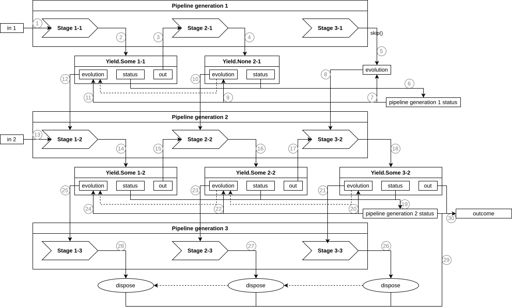

# A Diagram of a Simple Pipeline

In this example, I will show not a “real-world” pipeline, but a simplified model of one.  
The goal is not to demonstrate every feature of the library, but to use one small scenario to highlight three core
ideas:

- how stages are applied one after another;
- how a pipeline folds the statuses of individual stages into a single overall status;
- why `Evolution` methods are called in the order opposite to the order stages are applied, and what that guarantees.

The pipeline will consist of three stages. Each of them has two versions, that is, two generations.  
In a stage name, the first digit denotes its position in the pipeline, and the second digit denotes the pipeline
generation in which that version of the stage is used.

Since this example is illustrative, I will use only the basic `Stage` definitions from the `core` module.  
All methods that are not supposed to be called in this scenario are defined as `???`.

To avoid cluttering the example with repetitive placeholders, let us first introduce a small helper base class,
`MockEvolution`.  
All of its methods are already defined as `???`, so in the concrete stages we only need to override the ones that
actually matter in this example.

```scala mdoc
import h8io.stages.*

trait MockEvolution[-I, +O, +E] extends Evolution[I, O, E] {
  override def onSuccess(): Stage[I, O, E] = ???

  override def onComplete(): Stage[I, O, E] = ???

  override def onError(): Stage[I, O, E] = ???

  override def dispose(): Unit = ???
}
```

## Stage 1

The first stage works with integers.

`Stage 1-1` takes the input value, subtracts `3` from it, and returns the result with status `Success`.  
If the overall pipeline run later has to evolve along the `Error` branch, this stage becomes `Stage 1-2`.

```scala mdoc
object Stage11 extends Stage[Int, Int, Nothing] {
  override def apply(in: Int): Yield[Int, Int, Nothing] = {
    println(s"Apply Stage 1-1 to $in (${in.getClass.getSimpleName})")
    Yield.Some(
      in - 3,
      Status.Success,
      new MockEvolution[Int, Int, Nothing] {
        override def onError(): Stage[Int, Int, Nothing] = {
          println("Evolve Stage 1-1")
          Stage12
        }
      })
  }

  override def skip(): Evolution[Int, Int, Nothing] = ???
}
```

`Stage 1-2` is the next version of the first stage. It computes `5 - in` and returns status `Complete`.  
In this example, its further evolution is no longer important, but its participation in `dispose()` is.

```scala mdoc
object Stage12 extends Stage[Int, Int, Nothing] {
  override def apply(in: Int): Yield[Int, Int, Nothing] = {
    println(s"Apply Stage 1-2 to $in (${in.getClass.getSimpleName})")
    Yield.Some(
      5 - in,
      Status.Complete,
      new MockEvolution[Int, Int, Nothing] {
        override def dispose(): Unit = println("Dispose Stage 1-2")
      })
  }

  override def skip(): Evolution[Int, Int, Nothing] = ???
}
```

## Stage 2

The second stage turns a number into a string, but in the first generation it also performs an extra check.

`Stage 2-1` checks whether its input is zero.  
If the input is `0`, it returns `Yield.None` with status `Error("Zero")`. This means no value will be passed any further
down the pipeline.  
If the input is not zero, the stage simply turns the number into a string and returns `Success`.

In case of an error, `Stage 2-1` evolves into `Stage 2-2`.

```scala mdoc
object Stage21 extends Stage[Int, String, String] {
  override def apply(in: Int): Yield[Int, String, String] = {
    println(s"Apply Stage 2-1 to $in (${in.getClass.getSimpleName})")
    if (in == 0)
      Yield.None(
        Status.Error("Zero"),
        new MockEvolution[Int, String, String] {
          override def onError(): Stage[Int, String, String] = {
            println("Evolve Stage 2-1")
            Stage22
          }
        })
    else
      Yield.Some(in.toString, Status.Success, new MockEvolution[Int, String, String] {})
  }

  override def skip(): Evolution[Int, String, String] = ???
}
```

`Stage 2-2` is a simpler version of the second stage: it always converts its input value into a string.  
Like `Stage 1-2`, in this example it matters mainly as part of the second pipeline generation and as a participant in
the final `dispose()`.

```scala mdoc
object Stage22 extends Stage[Int, String, String] {
  override def apply(in: Int): Yield[Int, String, String] = {
    println(s"Apply Stage 2-2 to $in (${in.getClass.getSimpleName})")
    Yield.Some(
      in.toString,
      Status.Success,
      new MockEvolution[Int, String, String] {
        override def dispose(): Unit = println("Dispose Stage 2-2")
      })
  }

  override def skip(): Evolution[Int, String, String] = ???
}
```

## Stage 3

The third stage already works with strings and, in the first generation, is not applied directly at all.

`Stage 3-1` exists in this scenario only to demonstrate the role of `skip()`.  
If the previous stage produces no value and pipeline execution stops early, the downstream stage must still get a chance
to evolve correctly. That is exactly what `skip()` is for.

In this example, `Stage 3-1` evolves into `Stage 3-2` along the `Error` branch.

```scala mdoc
object Stage31 extends Stage[String, Boolean, Nothing] {
  override def apply(in: String): Yield[String, Boolean, Nothing] = ???

  override def skip(): Evolution[String, Boolean, Nothing] = {
    println("Skip Stage 3-1")
    new MockEvolution[String, Boolean, Nothing] {
      override def onError(): Stage[String, Boolean, Nothing] = {
        println("Evolve Stage 3-1")
        Stage32
      }
    }
  }
}
```

`Stage 3-2` is the working version of the third stage. It checks whether the input string contains a hyphen and returns
a `Boolean` result.

```scala mdoc
object Stage32 extends Stage[String, Boolean, Nothing] {
  override def apply(in: String): Yield[String, Boolean, Nothing] = {
    println(s"Apply Stage 3-2 to $in (${in.getClass.getSimpleName})")
    Yield.Some(
      in.contains("-"),
      Status.Success,
      new MockEvolution[String, Boolean, Nothing] {
        override def dispose(): Unit = println("Dispose Stage 3-2")
      })
  }

  override def skip(): Evolution[String, Boolean, Nothing] = ???
}
```

## Execution

Now let us build a pipeline out of the first generation of all three stages:

```scala mdoc
val pipeline1 = Stage11 ~> Stage21 ~> Stage31
```

The type of the resulting pipeline is `Stage[Int, Boolean, String]`.  
In other words, composition via `~>` is itself still a `Stage`: it takes the input of the first link, produces the
output of the last one, and folds the statuses of the individual stages into the overall pipeline status.

Let us run the first generation of the pipeline:

```scala mdoc
val yld = pipeline1(3)
```

The final status of the first generation is `Status.Error`:

```scala mdoc
yld.status.getClass
```

Once the run is complete, the resulting `Yield` can be used to build the next generation of the pipeline:

```scala mdoc
val pipeline2 = yld.evolve()
```

The static type of the pipeline remains the same. What changes is which versions of the stages now make up the
composition.

Let us run the second generation:

```scala mdoc
val yld2 = pipeline2(1)
```

Once the second generation has finished, let us call `dispose()` on its final `Evolution`:

```scala mdoc
yld2.evolution.dispose()
```

## Diagram



The diagram shows the same scenario as the code, but as a sequence of concrete objects and calls.  
The circled labels mark the execution steps, so in the description below I will refer to them directly.  
Dashed arrows indicate the execution sequence and show how control flows between objects.

In the first generation, the input value `3` is sent to `Stage 1-1` ①.  
`Stage 1-1` computes `3 - 3`, returns `Yield.Some` with value `0`, status `Success`, and an `Evolution` object ②.  
That value is then passed on to `Stage 2-1` ③.

At `Stage 2-1`, the pipeline reaches a branch that determines what happens next.  
Since the input is `0`, this stage returns `Yield.None` with status `Error("Zero")` ④.  
At that point there is no longer any value to pass downstream, so `Stage 3-1` is not invoked via `apply()`. Instead,
`skip()` is called for it, producing an `Evolution` object ⑤.

Once the active part of the first generation has finished, the pipeline folds the `Status` values it has already
obtained into a single overall status ⑥.  
In this case, the overall status of the first generation is `Error("Zero")`.

Now that this status is known, the pipeline can evolve into the next generation.  
All `Evolution` methods are called in the order opposite to the order in which stages are applied. This matters because
a downstream stage may depend on state or resources created by an upstream stage. If upstream stages were finalized or
reconfigured too early, downstream stages could lose what they still rely on.

First, the object obtained from `Stage 3-1.skip()` is used: along the `onError()` branch it creates `Stage 3-2` ⑦ ⑧.  
Then `Stage 2-1` evolves for the same reason: its `Evolution` moves the pipeline to `Stage 2-2` ⑨ ⑩.  
After that, `Stage 1-1` evolves into `Stage 1-2` ⑪ ⑫.

This is how the second generation of the pipeline is formed.

In the second generation, the input value `1` is fed into the pipeline ⑬.  
`Stage 1-2` computes `5 - 1`, returns `Yield.Some` with value `4`, status `Complete`, and a new `Evolution` object ⑭.  
Then the value `4` is passed to `Stage 2-2` ⑮, which converts it into the string `"4"` and returns `Yield.Some` with
status `Success` ⑯.  
After that, the string `"4"` is passed to `Stage 3-2` ⑰, which checks whether it contains the `'-'` character and
returns `Yield.Some` with value `false` and status `Success` ⑱.

Once all three stages of the second generation have finished, the pipeline folds their statuses into a single overall
status ⑲.  
The overall status of the second generation is `Complete`. At this point, the computational part of the pipeline is
done.

Next comes finalization.  
First, `dispose()` is called on the `Evolution` associated with the result of `Stage 3-2` ⑳.  
Then `dispose()` is called on the `Evolution` associated with the result of `Stage 2-2` ㉑.  
Finally, `dispose()` is called on the `Evolution` associated with the result of `Stage 1-2` ㉒.

If any of these `dispose()` calls fail, the failures are aggregated into a single exception ㉓.  
The earliest exception becomes the primary one, and all later exceptions are attached to it.

After that, the final `Outcome` ㉔ is assembled from three components:

- the output value of the second generation (`false`);
- the overall pipeline status (`Complete`);
- and the exception thrown during `dispose()`, if any.

That `Outcome` is the final result of the pipeline execution.
